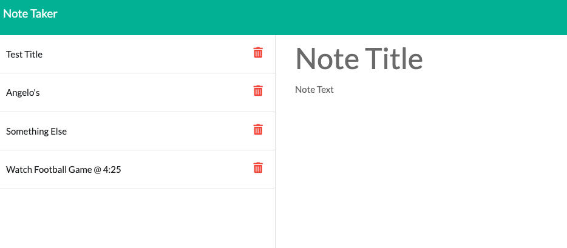

# Note Taker

## Description

This is a web application lets a user write and save notes.

## Table of Contents

- [Installation](#installation)
- [Usage](#usage)

## Installation

The user should clone the repository from GitHub and download Node.

## Usage

Use the deployed application via Heroku

